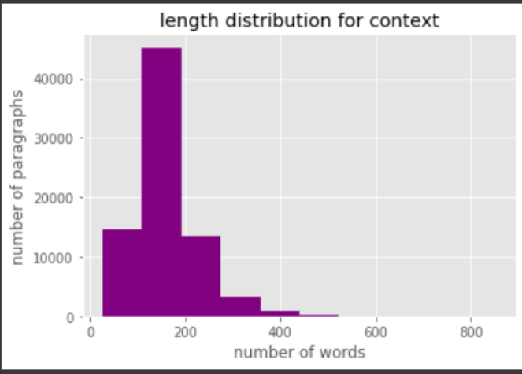
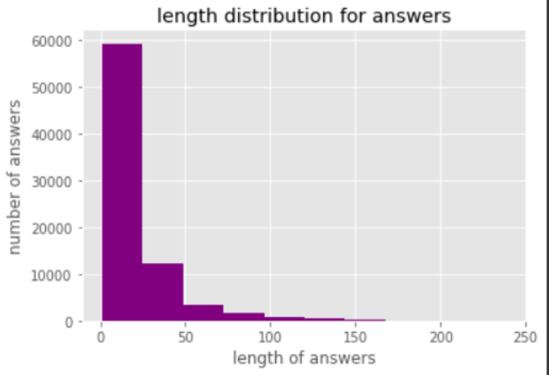

# Question-Answering-SQuAD
University project I did consisting of training a BERT model on the SQuAD dataset for the task of Question Answering

USAGE: compute_answers.py takes 1 file of questions in the SQuAD form and outputs a file with answers.

## 1. Executive Summary

The SQuAD dataset is based on a list of articles found on Wikipedia. Each article
is divided into paragraphs and each paragraph has a set of questions as well as a
list of possible answers. Our objective is to create a system that when given a
paragraph and a question regarding it, a single answer is provided. This answer
would be obtained selecting a span of text from the paragraph. To complete this we
decided to Fine-Tune a BERT language model using torch. In this report we will
discuss our methodology. We then created a script to run the model on unseen test
data, assuming this unseen data has answers as an empty value.

## 2. Preparing the Data

The SQuAD dataset was provided to us in json format as the training set. We
decided to split it into training/validation sets, giving 90 % of the data to training
and leaving 1 0 % to validation. This splitting was one based on title. Before that,
we turned the json format into a pandas dataframe for easier access.
Since the data already provided us with an answer start, we decided to add an
answer end column in the dataframe, that way we could have both the start and end
indexes of the answers. We did that by creating a function that would give us the
answer end.

## 3. BERT Architecture

BERT is an open-source ML framework for natural language processing. It is a
Bidirectional Encoder Representations from Transformers, meaning that it is based
on transformers. Bidirectionality means that the model can read text input from left
to right and vice versa at the same time, which has not been done with language
models before BERT.

BERT is designed to help machines understand the meaning of language in text by
using surrounding text to determine context. The framework was pre-trained using
text from Wikipedia and can be fine-tuned. In our project we fine-tuned it with the
SQuAD dataset using an additional Question Answering head.

## 4. Data Analysis

a. Figure 1 shows the distribution
of the lengths of the contexts, or
paragraphs, that hold the answers
to the questions. Maximum of the
number of words, from the graph,
was chosen at 400 taking the
99.4th percentile of context
lengths. The latter was chosen
based on available memory
resources. The minimum number
of words in the paragraphs was 26 Figure (1) and the maximum was 854.

b. Figure 2 shows the length
distribution of answers in
our test set. The minimum
length of answers is 1 and
the maximum 239.

## 5. Evaluation Model

We decided to train our dataset using the BERT architecture that we talked about
in section 3 , more specifically an uncased base model which we then fine-tuned.

Firstly, we tokenized our data using BertTokenizerFast method from that
Transformers library. This tokenizer takes a sentence as its input and gives a
dictionary consisting of 3 keys as its output. These keys are Input_ids,
Attention_mask, and token_type_ids.

We provide the tokenizer with the inputs train_contexts and train_question in order
to encode them in parallel and concatenate them. We truncate sequences to the
length supplied by the max_length argument (set to 400) by setting truncation to
True.

For reading data from our encoded train set and validation set, we define two
classes called SquadDataset and SquadDataset_Validation. We make use of
torch.utils.data for this. Dataset library's getitem() function and len() method are
defined as super classes in the library. These two classes don't really differ except
for the initialization of self.answers in the validation dataset. We include the real
answer that corresponds to its context as "full_text" in the validation data set.

### a. Bert Class
After importing BertModel and BertPreTrainedModel from the transformers
library, we have our Bert class inherit from BertPreTrainedModel as its
super class.

We initialized our class with three layers. Self.bert, uses config from
BertPreTrainedModel as an argument. The output of our Bert model is then
linearly transformed into two features using a Linear layer that we define.
For our model, we then define a criterion layer with the CrossEntropyLoss
function.

This class also includes a get_score function which returns the start and end
positions of the answers to be used in both evaluation and answer
predictions.

### b. Results

After evaluating the model on the validation set, we get the following
results:

EM = 0.6

F1 = 0.74

We then created a function predict() to predict answers from our data so that
we can visualize the results.

The following are some successful examples:

Paragraph:

The French Army consisted in peacetime of approximately 400,000 soldiers, some of
them regulars, others conscripts who until 1869 served the comparatively long period of
seven years with the colours. Some of them were veterans of previous French campaigns
in the Crimean War, Algeria, the Franco-Austrian War in Italy, and in the Franco-

Mexican War. However, following the "Seven Weeks War" between Prussia and Austria
four years earlier, it had been calculated that the French Army could field only 288,
men to face the Prussian Army when perhaps 1,000,000 would be required. Under
Marshal Adolphe Niel, urgent reforms were made. Universal conscription (rather than by
ballot, as previously) and a shorter period of service gave increased numbers of
reservists, who would swell the army to a planned strength of 800,000 on mobilisation.
Those who for any reason were not conscripted were to be enrolled in the Garde Mobile,
a militia with a nominal strength of 400,000. However, the Franco-Prussian War broke
out before these reforms could be completely implemented. The mobilisation of reservists
was chaotic and resulted in large numbers of stragglers, while the Garde Mobile were
generally untrained and often mutinous.

Question:

In peacetime, what the approximate number of French soldiers?

Real Answer: 400,

Predicted Answer: 400, 000

Paragraph:

In 2013, China led the world in renewable energy production, with a total capacity of 378
GW, mainly from hydroelectric and wind power. As of 2014, China leads the world in
the production and use of wind power, solar photovoltaic power and smart grid
technologies, generating almost as much water, wind and solar energy as all of France
and Germany's power plants combined. China's renewable energy sector is growing faster
than its fossil fuels and nuclear power capacity. Since 2005, production of solar cells in
China has expanded 100-fold. As Chinese renewable manufacturing has grown, the costs
of renewable energy technologies have dropped. Innovation has helped, but the main
driver of reduced costs has been market expansion.

Question:

What is the main driver of reduced costs?

Real Answer: market expansion

Predicted Answer: market expansion

Paragraph:

In 1989, Prince Andrew launched the replacement RMS St Helena to serve the island; the
vessel was specially built for the Cardiff–Cape Town route and features a mixed
cargo/passenger layout.

Question:
Who launched the replacement RMS St Helena?

Real Answer: Prince Andrew
Predicted Answer: prince andrew

But of course, there are some that did not match:
Paragraph:
A lone naked human is at a physical disadvantage to other comparable apex predators in
areas such as speed, bone density, weight, and physical strength. Humans also lack innate
weaponry such as claws. Without crafted weapons, society, or cleverness, a lone human
can easily be defeated by fit predatory animals, such as wild dogs, big cats and bears (see
Man-eater). However, humans are not solitary creatures; they are social animals with
highly developed social behaviors. Early humans, such as Homo erectus, have been using
stone tools and weapons for well over a million years. Anatomically modern humans
have been apex predators since they first evolved, and many species of carnivorous
megafauna actively avoid interacting with humans; the primary environmental competitor
for a human is other humans. The one subspecies of carnivorous megafauna that does
interact frequently with humans in predatory roles is the domestic dog, but usually as a
partner in predation especially if they hunt together. Cannibalism has occurred in various
places, among various cultures, and for various reasons. At least a few people, such as the
Donner party, are said to have resorted to it in desperation.

Question:
What are humans' primary competitors?
Real Answer: other humans
Predicted Answer:

6. Validation of the Model

We decided to evaluate the model every 2000 iteration on the validation set

First, we define two functions: compute_exact and compute_f1.

### a. Exact Match

It matches the full text with the prediction. If it is matched it returns 1,
otherwise returns 0. Then loops through the dataset, adds the returned results
together, then divides by the length of the dataset.

### b. F1 Score

### c. Evaluation Function

To evaluate our predicted start and end positions of the answer, we build an
evaluate function. We provide the function with our data set and model for
this purpose. We obtain a score for both the start and end positions by using
the model.get_score method. We next obtain our predicted answer from
context using these two predicted positions. Exact Match Score and F
Score can now be calculated using the functions compute_exact and
compute_f1 respectively.

## 7. Text Cleaning

We did some light text cleaning of the predicted answers only. This can be seen in
section 6.c where sometimes our predicted answer had a different format that the
original answer.

The text cleaning included the following functions:

- remove_article: to remove articles from the text.
- white_space_fix: to fix some unneeded spaces in the text.
- remove_punc: to remove punctuation marks from the text.
- lower function: to lower case every word in the text.

## 8. Compute Answers

To compute the answers of the test set that is not available to us, we wrote another
script which takes the project folder as the current working directory, the directory
that contains the scripts and the saved model and takes the json test file as
command line input. We assume that, in the unseen data, we have an answers
attribute that is left blank (i.e. formatted the same way as our training data).

We went about doing the pre-processing of reading the data and cleaning the text
of the predicted answers in the same way as our Question Answering notebook, we
also added the Bert Class we had created so that we can use its get_score function
for the prediction.

Afterwards, we load the saved model from the project folder and predict the
answers using the same predict function as our notebook that was mentioned in
section 6.c. The only difference is that the output will be in the form of a json file
called pred.json and it will be of the format of a dictionary that gives us the id of
the question as its key and the predicted answer as its value.

## 9. Discussion

During this experimented we successfully used a language model, namely BERT,
to tackle the SQUAD Question answering problem.

In our experiment, we were limited with our hardware, and therefore could not
train for an extensive amount of time. In fact we couldn’t train past 2 epochs to
better determine overfitting and when to stop training. Possible
extensions/modifications could be using distilled knowledge to solve the resources
shortage.
